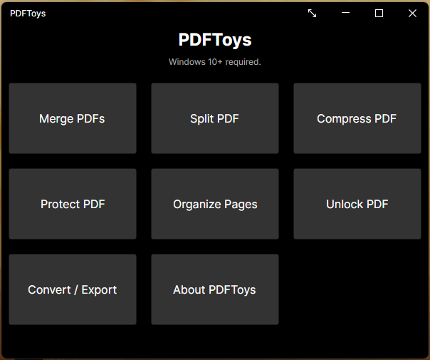

# PDFToys

## Introduction

PDFToys is a Windows desktop utility for common PDF workflows: merge, split, compress, protect, unlock, organize pages, convert files to PDF, and export PDFs to images or Markdown.



## Installation

PDFToys runs on 64-bit Windows 10 or later. The installer is self-contained, so you do not need to install the .NET runtime separately. Microsoft Word, Excel, or PowerPoint is needed only when converting the corresponding Office documents to PDF.

The first public installer release has not been published yet. When it is available, download `PDFToys-0.1.0-setup.exe` from the [latest release](https://github.com/MohammedSaad114/PDFToys/releases/latest), run the setup file, then open PDFToys from the Start menu or its optional desktop shortcut. The installer registers the Explorer context menu automatically.

## Features and quick start

PDFToys can merge, split, compress, protect, and unlock PDFs; organize pages; convert files to PDF; and export PDFs as images or Markdown.

To merge PDFs:

1. Open PDFToys and choose **Merge PDFs**.
2. Select at least two PDFs and drag them into the order you want.
3. Choose **Execute Merge**. When the inputs share a folder, PDFToys saves `Merged_Output.pdf` there (adding a number if that name exists). For inputs from different folders, choose an output location in the save dialog.


## Limitations

- **Compress** recompresses embedded images. Text-only PDFs may see little size reduction.
- **Markdown export** extracts text content; it is not layout-aware Markdown.
- **Office conversion** requires locally installed Office applications and uses COM automation.

## Building from source

Developer requirements:

- .NET 9 SDK for the app and tests
- Visual Studio C++ build tools with ATL support for the native shell extension
- Inno Setup only if compiling the installer

```powershell
dotnet restore src/PDFToys.Core/PDFToys.Core.csproj
dotnet restore tests/PDFToys.Core.Tests/PDFToys.Core.Tests.csproj
dotnet restore src/PDFToys.App/PDFToys.App.csproj
dotnet restore tests/PDFToys.App.Tests/PDFToys.App.Tests.csproj

dotnet build src/PDFToys.Core/PDFToys.Core.csproj -c Release
dotnet build tests/PDFToys.Core.Tests/PDFToys.Core.Tests.csproj -c Release
dotnet build src/PDFToys.App/PDFToys.App.csproj -c Release
dotnet build tests/PDFToys.App.Tests/PDFToys.App.Tests.csproj -c Release

dotnet test tests/PDFToys.Core.Tests/PDFToys.Core.Tests.csproj -c Release --no-build
dotnet test tests/PDFToys.App.Tests/PDFToys.App.Tests.csproj -c Release --no-build
```

CI runs the same project-scoped build and test steps on `windows-latest` via GitHub Actions.

## Publishing and packaging

Run `build-shell-extension.ps1` from **Developer PowerShell for Visual Studio** so `msbuild` and the C++/ATL toolchain are available.

```powershell
.\scripts\publish.ps1
.\scripts\build-shell-extension.ps1
.\scripts\package-layout.ps1
```

Compile the optional Inno Setup installer after `package-layout.ps1`:

```powershell
iscc installer\PDFToys.iss
```

Release builds should be signed with Authenticode (`signtool`) before distribution. See the commented placeholder in `scripts\publish.ps1`.

## Developer shell-extension setup

The installer registers and unregisters the Explorer context menu for users. If you built from source without the installer, first run the publishing and packaging scripts above. The shell extension requires `PDFToys.App.exe` beside its DLL, so register the packaged DLL from an elevated PowerShell session in the repository root:

```powershell
.\scripts\register-shell-extension.ps1 -DllPath ".\artifacts\package\PDFToys.ShellExtension.dll"
```

To unregister a manually installed extension:

```powershell
.\scripts\register-shell-extension.ps1 -Action unregister -DllPath ".\artifacts\package\PDFToys.ShellExtension.dll"
```

## Security and data handling

- **Office COM**: Converting `.doc`, `.docx`, `.xls`, `.xlsx`, `.ppt`, and `.pptx` launches Word, Excel, or PowerPoint invisibly via COM.
- **Replace original**: Protect and Unlock can overwrite the source PDF. A best-effort backup is written to `{filename}.pdftoys.bak` before overwrite when possible.
- **Headless logs**: Context-menu headless runs write diagnostics to `%LocalAppData%\PDFToys\logs`. Logs include file paths and error messages, not passwords.
- **Settings**: User preferences are stored in `%LocalAppData%\PDFToys\settings.json`.

## Troubleshooting / reporting issues

- **Explorer menu missing:** On Windows 11, right-click a PDF and choose **Show more options** to find the classic PDFToys context menu. If it still does not appear, reinstall PDFToys. Developers using a manual build can use the registration script above.
- **Context-menu operation fails:** Check `%LocalAppData%\PDFToys\logs` for the latest diagnostic log. The same folder can be opened by entering that path in File Explorer's address bar.
- **Report a bug:** If the repository is accessible to you, open an issue in [GitHub Issues](https://github.com/MohammedSaad114/PDFToys/issues). Include your PDFToys and Windows versions, steps to reproduce, the expected and actual result, and relevant log messages. Remove private file paths before sharing logs.

## Changelog and license

See the [changelog](CHANGELOG.md) for release notes. PDFToys is distributed under the Apache License 2.0; see [LICENSE](LICENSE) and [NOTICE](NOTICE) for third-party attributions.
